## アプリ紹介
- このアプリは従業員のシフトを管理するアプリです。 
- frontendとbackendは分かれておらずDjangoのみで作成しています。
## 機能
### ユーザ登録
#### ログイン画面
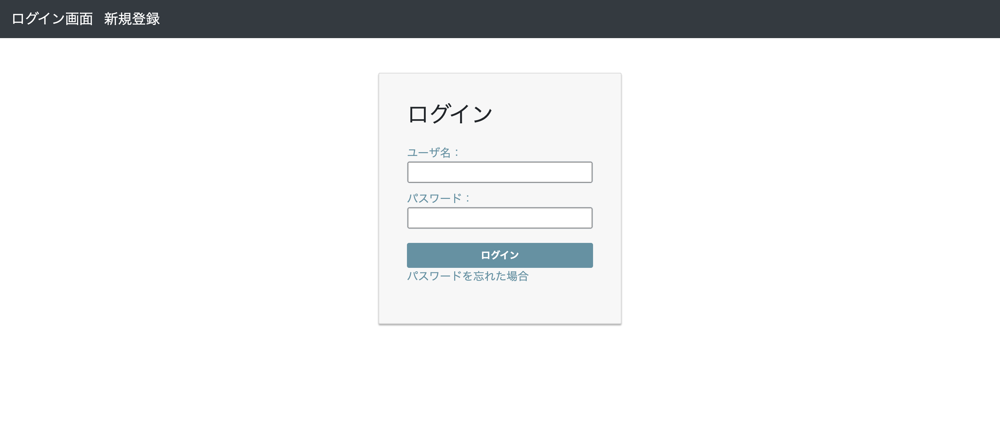
#### ユーザ登録画面
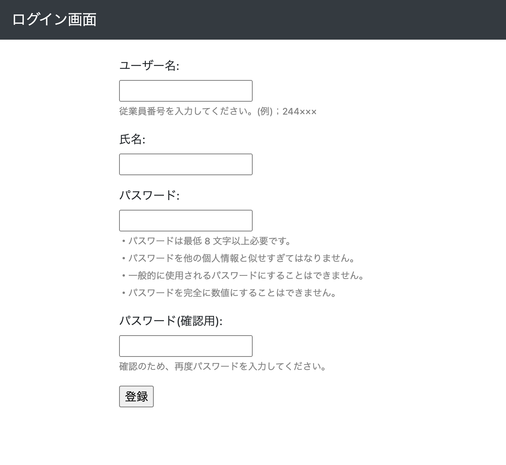
### 希望シフトの提出/確認
#### シフトの提出
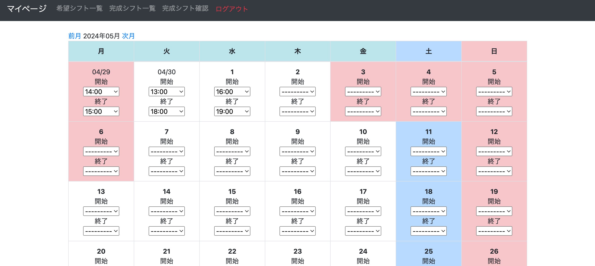
#### シフトの確認
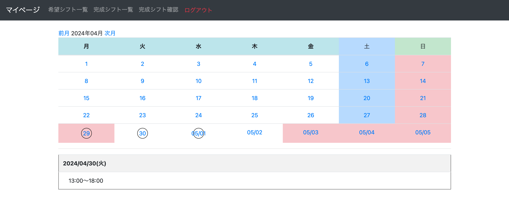
### 希望シフトの完了(ユーザ側)
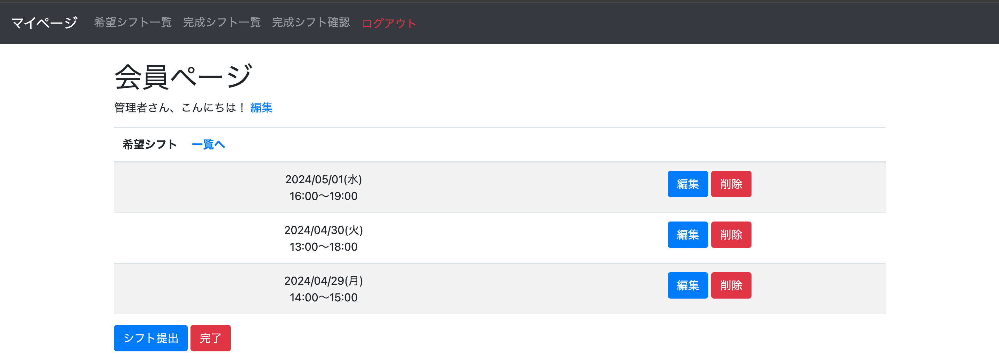
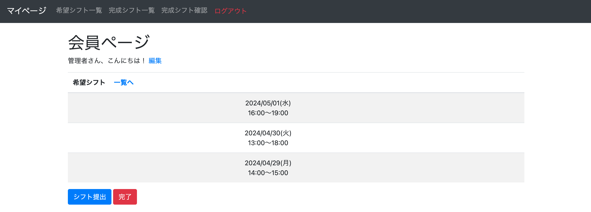
### 希望シフトの完了(管理者側)
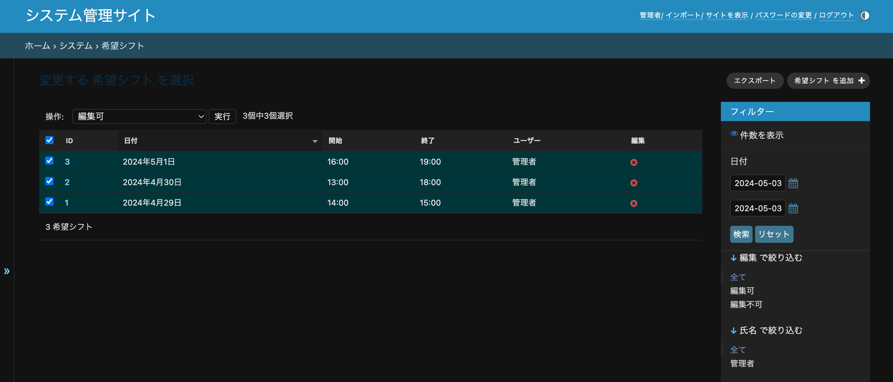
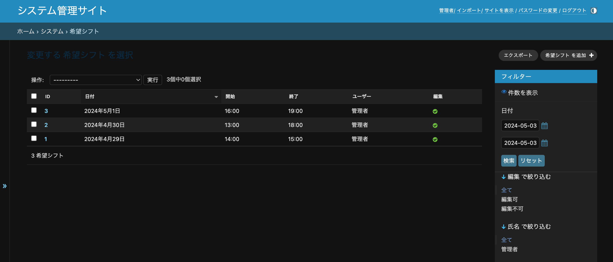
### 管理画面
#### ユーザー
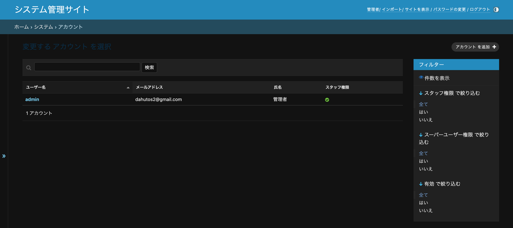
#### 完成シフトのimport
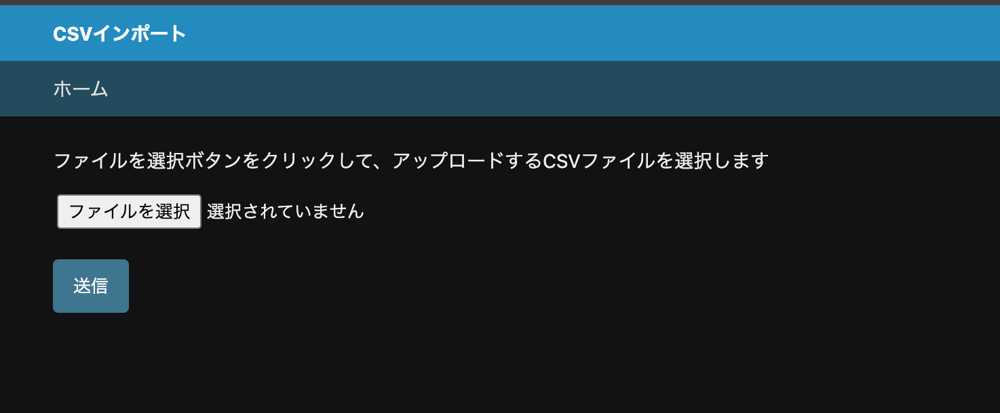
#### 現在までのシフト状況の確認
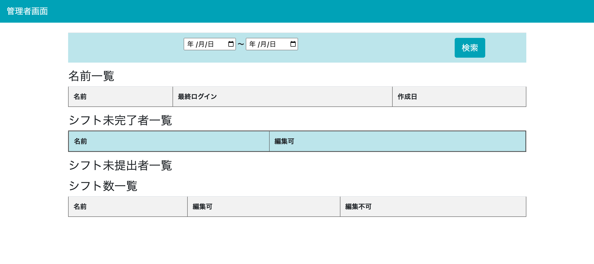
